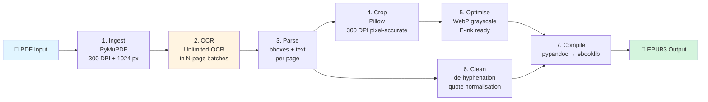
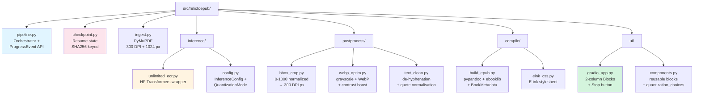

# RelicToEpub

[](https://github.com/Simmonne374/DAPDFAEPUB/actions/workflows/build-windows.yml)
[](https://github.com/Simmonne374/DAPDFAEPUB/releases/tag/latest)
[](LICENSE)
[](https://www.python.org/downloads/)

> **PDF → EPUB3** pipeline powered by **[Baidu Unlimited-OCR](https://arxiv.org/abs/2606.23050)** (R-SWA architecture).
> A lightweight Python wrapper around a state-of-the-art open-source document-parsing model.

Download the latest Windows installer from the [Releases page](../../releases) — pick tag `latest` for the most recent build, or a specific `build-<commit>` tag for a pinned snapshot.

---

## 📑 Table of contents

1. [Overview](#-overview)
2. [How it works](#-how-it-works)
3. [Hardware requirements](#-hardware-requirements)
4. [Installation](#-installation)
   - [System prerequisites](#1-system-prerequisites)
   - [Virtual environment](#2-virtual-environment)
   - [Python dependencies](#3-python-dependencies)
   - [Model download](#4-model-download)
   - [Windows installer (end users)](#5-windows-installer-end-users)
5. [Usage](#-usage)
   - [CLI — single book](#cli--single-book)
   - [Gradio UI](#gradio-ui)
   - [Python API](#python-api)
6. [Architecture](#-architecture)
7. [Known limitations & resume](#-known-limitations)
8. [Testing](#-testing)
9. [References](#-references)
10. [License](#-license)

---

## 🔎 Overview

**RelicToEpub** converts scanned PDFs into **reflowable EPUB3** files tuned for E-ink readers (Kindle, Kobo, reMarkable, …).

The OCR engine is **Baidu Unlimited-OCR** ([arXiv:2606.23050](https://arxiv.org/abs/2606.23050), MIT, 3B-MoE with 0.5B activated parameters), which is **state of the art** on **Books / Magazines / Newspapers** in the [OmniDocBench](https://github.com/OpenDataLab/OmniDocBench) benchmark (overall **93.23** on v1.5).

### Why Unlimited-OCR?

| Strength | What it means for you |
|---|---|
| 🥇 **SOTA accuracy** | Outperforms models 80× larger (Qwen3-VL 235B, InternVL3.5 241B) on OmniDocBench |
| ⚡ **Compact MoE** | 3B total / 500M active → runs on entry-level GPUs |
| 🔓 **MIT licensed** | Use, modify, and ship commercially without restrictions |
| 🧠 **32K context** | One-shot parsing of dense, multi-page layouts |

### Key features

- 🖼️ **Smart figure extraction** — detects `image`, `figure`, and `table` blocks and stitches their captions automatically (issue #10).
- ♻️ **Checkpoint & resume** — long OCR runs are saved batch-by-batch; Ctrl+C, crashes or OOMs no longer lose progress.
- ⏹️ **Cooperative cancel** — a "Stop" button in the UI aborts cleanly between OCR batches.
- 🎨 **E-ink image optimisation** — grayscale + WebP with contrast boost for low-contrast e-ink screens.
- 🧹 **Text normalisation** — soft-hyphen de-hyphenation, smart-quote conversion, whitespace collapsing.

---

## ⚙️ How it works



### Processing stages

| # | Phase | Tool | Output |
|---|---|---|---|
| 1 | **Ingest** | PyMuPDF | Hi-res 300 DPI page PNGs + normalised 1024×1024 squares |
| 2 | **OCR** | Unlimited-OCR (HF Transformers) | Markdown with `<|det|>` bbox tags + `<page>` separators |
| 3 | **Parse** | regex + dataclasses | Per-page: cleaned text + bbox list (image / figure / table) |
| 4 | **Crop** | Pillow | 300-DPI pixel-aligned image crops from normalised bboxes |
| 5 | **Optimise** | Pillow (WebP) | Grayscale 8-bit, contrast-boosted, E-ink ready |
| 6 | **Clean** | regex (text_clean) | De-hyphenation + smart-quote → ASCII normalisation |
| 7 | **Compile** | pypandoc → ebooklib | Semantic XHTML → valid EPUB3 package |

> 🧠 The OCR stage runs **in batches of 20 pages by default** (configurable up to ~30) to stay inside Unlimited-OCR's 32K-token context window.

---

## 💻 Hardware requirements

| Setup | GPU | VRAM | System RAM | Notes |
|---|---|---|---|---|
| 🟢 **Recommended** | GTX 1080 Ti or newer | 11 GB | 16 GB | 4-bit NF4 quantization (default) |
| 🟡 **Higher accuracy** | RTX 30xx / 40xx / 50xx, A100 | ≥ 16 GB (int8) or ≥ 24 GB (no quant) | 16 GB | 8-bit or no quantization |
| 🔴 **CPU only** | — | — | 32 GB | ~1 min / page; fine for MVP (1–10 books) |

The model itself weighs ~6 GB; **without quantization** it needs ≥ 12 GB VRAM, **8-bit** fits in ~3 GB, **4-bit** is the sweet-spot for entry-level GPUs.

> 💡 Unlimited-OCR's MoE architecture (3B / 500M active) makes it viable on hardware that can't run larger VLMs.

### Quantization options

| Mode | VRAM footprint | Quality | Best for |
|---|---|---|---|
| `none` (BF16/FP16) | ~6 GB | Highest | RTX 30xx/40xx/50xx, A100, H100 |
| `int8` | ~3 GB | High | Mid-range GPUs with ≥ 16 GB |
| `int4` (NF4) | ~2 GB | Good (default) | GTX 1080 Ti and any GPU ≥ 8 GB |

---

## 📦 Installation

### 1. System prerequisites

| Tool | How to install | Notes |
|---|---|---|
| **Python 3.10+** | [python.org](https://www.python.org/downloads/) | 3.11 recommended. **Avoid 3.14** — torch CUDA wheels are not yet stable. |
| **pandoc** | [github.com/jgm/pandoc](https://github.com/jgm/pandoc/releases) | Required by `pypandoc`. Windows: MSI installer. |
| **uv** *(optional)* | `pip install uv` | Fast package manager — recommended. |

### 2. Virtual environment

```bash
# Standard venv
python -m venv .venv
source .venv/bin/activate        # Linux / macOS
.venv\Scripts\activate           # Windows (bash / Git Bash)

# Or with uv (faster)
uv venv
```

### 3. Python dependencies

```bash
# CPU-only stack (simplest — no NVIDIA GPU)
uv pip install -e ".[dev,cpu]"

# Pascal GPU (GTX 1080 Ti, GTX 1070, …) — CUDA 11.8
uv pip install torch --index-url https://download.pytorch.org/whl/cu118
uv pip install -e ".[dev]"

# Ampere / Hopper GPU (RTX 30xx / 40xx / 50xx, A100, H100) — CUDA 12.4
uv pip install torch --index-url https://download.pytorch.org/whl/cu124
uv pip install -e ".[dev]"
```

### 4. Model download

The Unlimited-OCR model (~6 GB, MIT) is downloaded automatically on the first pipeline run.
To pre-fetch it (recommended — the first download can take 5-20 minutes):

```bash
# Helper script with progress bar
python scripts/download_model.py

# …or via the HuggingFace CLI
huggingface-cli download baidu/Unlimited-OCR --include "*.safetensors" "*.json" "*.py"
```

The model is cached under `~/.cache/huggingface/` by default.

### 5. Windows installer (end users)

A turn-key **Inno Setup** installer bundles Python, dependencies, and pandoc.
See [`docs/INSTALL_WINDOWS.md`](docs/INSTALL_WINDOWS.md) for full details.

**Path notes:**

- 🖥️ Shortcuts are placed on the **current user's Desktop** (not the Public Desktop, which would require admin rights).
- 📂 The installation folder lives in `%ProgramFiles%\RelicToEpub` and **requires admin privileges**.
- 💾 For USB / portable installs, do a first install on a "fixed" system to populate the torch wheel cache (~1.5 GB) and OCR model cache (~6 GB) under `%LOCALAPPDATA%\RelicToEpub\`. Subsequent installs reuse this cache and avoid downloading tens of GB again.

---

## 🚀 Usage

### CLI — single book

```bash
# Minimal
python scripts/convert_one.py path/to/book.pdf output.epub

# Full options
python scripts/convert_one.py path/to/book.pdf output.epub \
    --quant int4 \
    --dpi 300 \
    --pages-per-batch 20 \
    --title "My Book" \
    --author "Jane Doe" \
    --language en
```

#### CLI flags

| Flag | Default | Description |
|---|---|---|
| `input` | — | Source PDF (required) |
| `output` | `<input>.epub` | Destination EPUB |
| `--quant` | `int4` | Quantization: `none`, `int8`, `int4` |
| `--dpi` | `300` | Rendering DPI for crop generation |
| `--pages-per-batch` | `20` | Pages per OCR forward pass (≤ 30 recommended) |
| `--title` | PDF filename | Book title in EPUB metadata |
| `--author` | `Unknown` | Author in EPUB metadata |
| `--language` | `it` | ISO 639-1 language code |
| `--chapter-pages` | `None` | Group pages into N-page chapters when the book has no heading structure |
| `--no-eink-optim` | off | Disable WebP/E-ink image optimization |
| `--resume` / `--no-resume` | `--resume` | Use / discard cached OCR batches |
| `-v`, `--verbose` | off | DEBUG-level logging |

The script prints a textual progress bar (via `rich`) and writes the final EPUB when done. See [`docs/CLI.md`](docs/CLI.md) for full details.

### Gradio UI

```bash
python scripts/launch_ui.py
# → opens http://127.0.0.1:7860 in your default browser

# Custom host/port + public share link
python scripts/launch_ui.py --host 0.0.0.0 --port 7860 --share
```

The interface (2-column `gr.Blocks` layout) exposes:

- 📤 **Left column** — PDF upload, collapsible advanced options, Convert / Stop buttons, checkpoint status panel.
- 📊 **Right column** — live progress bar, streaming log, preview gallery, downloadable EPUB file, run summary.

### Python API

```python
from pathlib import Path
from relictoepub.pipeline import Pipeline
from relictoepub.inference.config import InferenceConfig, QuantizationMode

pipeline = Pipeline(
    inference_config=InferenceConfig(quantization=QuantizationMode.INT4),
    dpi=300,
    target_size=1024,
    max_pages_per_batch=20,
    eink_optimize=True,
)

# Synchronous: returns a PipelineResult when finished
result = pipeline.run(
    input_pdf=Path("samples/book.pdf"),
    output_epub=Path("output/book.epub"),
)
print(result.pages_processed, result.images_extracted, result.total_seconds)

# Generator: yields ProgressEvent for live UIs / progress callbacks
for event in pipeline.run_iter(Path("samples/book.pdf"), Path("output/book.epub")):
    print(event.phase, event.percent, event.message)
    if event.phase == "done":
        break
```

---

## 🏗️ Architecture



### Module map

| Layer | Module | Responsibility |
|---|---|---|
| **0. Checkpoint** | `checkpoint.py` | Atomic JSON checkpoint store keyed by PDF SHA256 — enables resume / cancel |
| **Orchestrator** | `pipeline.py` | `Pipeline` + `ProgressEvent` + `run` / `run_iter` (generator API) |
| **1. Ingest** | `ingest.py` | PDF → 300 DPI hi-res + 1024×1024 normalised squares (PyMuPDF) |
| **2. Inference** | `inference/unlimited_ocr.py` | Lazy HF Transformers wrapper for Unlimited-OCR |
| | `inference/config.py` | `InferenceConfig` dataclass + `QuantizationMode` enum (none / int8 / int4) |
| **3. Postprocess** | `postprocess/bbox_crop.py` | Convert paper's `[0, 1000]` bboxes → 300 DPI pixel crops (with `BBox` dataclass) |
| | `postprocess/webp_optim.py` | Grayscale + contrast boost + WebP for E-ink |
| | `postprocess/text_clean.py` | Soft-hyphen merge, smart-quote → ASCII, whitespace collapse |
| **4. Compile** | `compile/build_epub.py` | Markdown → XHTML (pypandoc) → EPUB3 package (ebooklib) + `BookMetadata` |
| | `compile/eink_css.py` | E-ink optimised CSS injected into every EPUB |
| **5. UI** | `ui/gradio_app.py` | 2-column Gradio `Blocks` app, Stop / Cancel support, checkpoint status panel |
| | `ui/components.py` | Reusable `gr.Blocks` factories + adaptive quantization choices |

### Entry points (scripts/)

| Script | Purpose |
|---|---|
| `scripts/convert_one.py` | CLI for converting a single PDF — full argument parser (`--quant`, `--dpi`, `--pages-per-batch`, `--chapter-pages`, `--resume`, …) |
| `scripts/launch_ui.py` | Boots the Gradio UI (`--host`, `--port`, `--share`) |
| `scripts/download_model.py` | Pre-downloads Unlimited-OCR with progress bar (~6 GB) |

---

## ⚠️ Known limitations

1. **32K token context** → batches of ~20–30 pages per forward pass. The pipeline automatically batches larger books and persists progress between batches (see Checkpoint & Resume below).
2. **Base mode 1024×1024** may lose very small text on dense pages.
3. **Future 128K context** is on Baidu's roadmap — when released, just update `max_length` in `inference/config.py`.

### Checkpoint & Resume

OCR is the slowest phase and can be interrupted by `Ctrl+C`, OOM crashes, or power loss. To make long conversions survivable, the pipeline:

- Saves a JSON checkpoint in `<pdf_dir>/.relictoepub_checkpoints/state.json` after every OCR batch (atomic tmp → fsync → rename).
- Keys the checkpoint by **SHA256 of the source PDF** — if the PDF changed, the resume refuses with a clear error (use `--no-resume` to override).
- Exposes cooperative cancel via `Pipeline.cancel()` — the Gradio "Stop" button triggers it; the in-flight batch finishes, then the pipeline exits cleanly.

```bash
# First run — partial conversion
python scripts/convert_one.py big_book.pdf
# Ctrl+C after a few batches → state.json is on disk

# Re-run same command → ♻️ Checkpoint trovato: 12/35 batch già OCR-ati
python scripts/convert_one.py big_book.pdf

# Force a clean re-run (e.g. after upgrading the model)
python scripts/convert_one.py big_book.pdf --no-resume
```

---

## 🧪 Testing

```bash
pytest                # fast — no model required
pytest --run-slow     # includes tests that load Unlimited-OCR
```

Test markers (see `pyproject.toml`):

- `slow` — tests that require the Unlimited-OCR model
- `gpu` — tests that require a CUDA-capable GPU
- `golden` — tests comparing against committed EPUB golden files (use `--update-golden` to regenerate)

---

## 📚 References

- 📄 Paper: *Unlimited OCR Works — Welcome the Era of One-shot Long-horizon Parsing*, Baidu 2026 — [arXiv:2606.23050](https://arxiv.org/abs/2606.23050)
- 🤖 Model: [huggingface.co/baidu/Unlimited-OCR](https://huggingface.co/baidu/Unlimited-OCR) (MIT)
- 💻 Reference code: [github.com/baidu/Unlimited-OCR](http://github.com/baidu/Unlimited-OCR)
- 📊 Benchmark: [OmniDocBench](https://github.com/OpenDataLab/OmniDocBench)

---

## 📜 License

[MIT](LICENSE) — see `LICENSE` for the full text.
